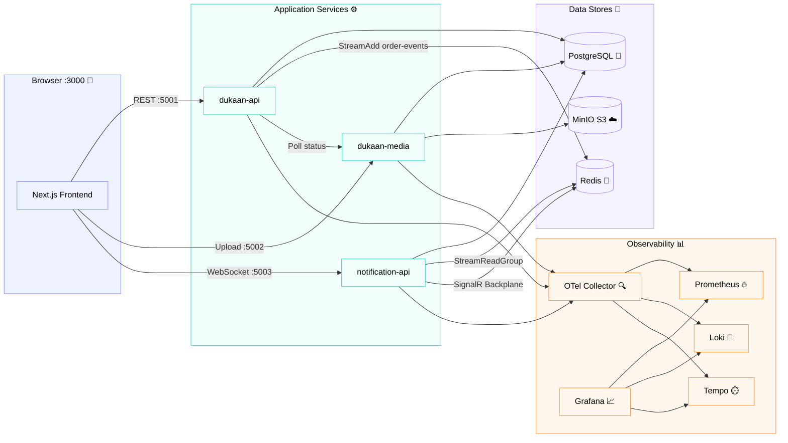

# Dukaan

Multi-vendor e-commerce platform with a .NET backend and Next.js frontend.

## Prerequisites

- Node.js 20+
- Docker & Docker Compose
- .NET 10 SDK

## Project Structure

```
├── backend/
│   ├── docker-compose.yml    # Infrastructure & API services
│   ├── Dukaan/               # .NET Web API (merchant & store APIs)
│   ├── Dukaan.Media/         # .NET media service (image/file upload)
│   └── Dukaan.Notification/  # .NET notification service (real-time push)
├── frontend/
│   └── dukaan-web/           # Next.js 16 web app
├── AGENTS.md                 # Project standards & conventions
└── README.md
```

## Infrastructure



## Running the Project

### 1. Start Backend (Docker)

```bash
cd backend
docker compose up -d
```

This starts:
| Service           | Port  | Description                        |
| ----------------- | ----- | ---------------------------------- |
| Postgres          | 5433  | Database                           |
| Redis             | 6379  | Cache, streams, pub/sub            |
| Dukaan API        | 5001  | Main backend API                   |
| Dukaan Media      | 5002  | Media upload service               |
| Notification API  | 5003  | Real-time notification push        |
| MinIO             | 9000  | Object storage (S3-compatible)     |
| MinIO Console     | 9001  | MinIO web UI                       |
| Grafana           | 3001  | Observability dashboard            |
| Loki              | 3100  | Log aggregation                    |
| Tempo             | 3200  | Distributed tracing                |
| Prometheus        | 9091  | Metrics                            |
| Otel Collector    | 4317  | OpenTelemetry endpoint             |

Wait for the API to be healthy, then verify:

```bash
curl http://localhost:5001/health
```

### 2. Start Frontend

```bash
cd frontend/dukaan-web
npm install
npm run dev
```

Opens at [http://localhost:3000](http://localhost:3000).

### Quick Start (run both)

```bash
# Terminal 1 - Backend
cd backend && docker compose up -d

# Terminal 2 - Frontend
cd frontend/dukaan-web && npm run dev
```

## Environment Variables

### Backend

Set in `backend/docker-compose.yml`. Key variables:

| Variable                              | Default                              |
| ------------------------------------- | ------------------------------------ |
| `ASPNETCORE_ENVIRONMENT`              | Development                          |
| `ConnectionStrings__DefaultConnection`| Host=postgres;Port=5432;Database=... |
| `MediaService__BaseUrl`               | http://dukaan-media:8080             |

### Frontend

Create `frontend/dukaan-web/.env.local`:

```env
NEXT_PUBLIC_API_URL=http://localhost:5001
NEXT_PUBLIC_MEDIA_API_URL=http://localhost:5002
NEXT_PUBLIC_MINIO_URL=http://localhost:9000/dukaan-media
NEXT_PUBLIC_NOTIFICATION_API_URL=http://localhost:5003
```

## Stopping

```bash
cd backend && docker compose down
```
